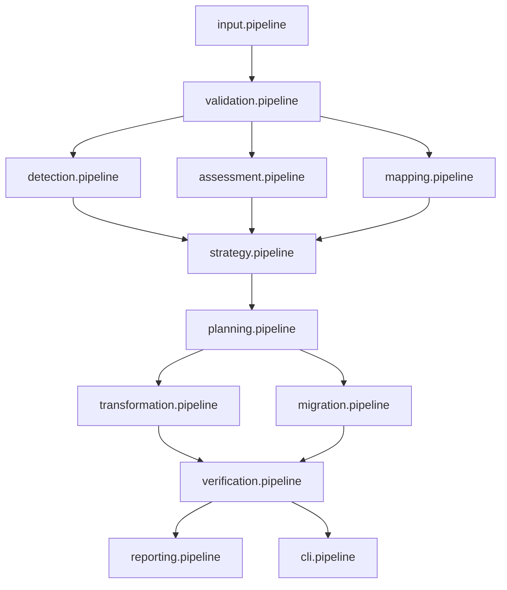

# Pipeline Reorganization Implementation

This directory contains the reorganized pipeline type definitions based on the flow-based naming strategy. The structure follows a clear data flow progression from input to output, enforcing SSOT and SRP principles.

## Flow-Based Structure

### Input/Ingestion Layer
- `input.pipeline.d.ts` - File system scanning, project discovery
- `validation.pipeline.d.ts` - Schema validation, input sanitization

### Analysis Layer
- `detection.pipeline.d.ts` - Pattern detection, code analysis
- `assessment.pipeline.d.ts` - Risk assessment, quality metrics
- `mapping.pipeline.d.ts` - Type mapping, dependency analysis

### Decision Layer
- `strategy.pipeline.d.ts` - Migration strategy selection
- `planning.pipeline.d.ts` - Execution planning, dependency ordering

### Execution Layer
- `transformation.pipeline.d.ts` - Code transformation, refactoring
- `migration.pipeline.d.ts` - File movement, import updates
- `verification.pipeline.d.ts` - Post-migration validation

### Output Layer
- `reporting.pipeline.d.ts` - Report generation, metrics output
- `cli.pipeline.d.ts` - CLI interface, user interaction

## Data Flow Dependencies



## Constitutional Compliance

Each pipeline file MUST follow these rules:

### ✅ Required Patterns
- Import all types from `/types/**` (no local definitions)
- Use `ApiResponse<T>` for all operation results
- Validate inputs with corresponding Zod schemas
- Return via `apiUtils.ok/err` + `createApiError`

### ❌ Prohibited Patterns
- Local type/interface definitions
- Type assertions without validation (`as Type`)
- Re-exports or aliases of canonical types
- Framework dependencies in foundation/core layers

## Type Definition Patterns

Each pipeline should follow this structure:

```typescript
// ✅ Correct - Import from canonical source
import type { 
  ApiResponse, 
  ValidationError 
} from "@/types/types/foundation.types";

// ✅ Correct - Extend canonical types via declaration merging
declare module "@/types/pipelines" {
  interface PipelineRegistry {
    detection: DetectionPipelineOps;
  }
}

// ✅ Correct - Pipeline-specific operation interfaces
export interface DetectionPipelineOps {
  scanForPatterns: (input: ScanRequest) => ApiResponse<PatternResults>;
  analyzeComplexity: (code: CodeBlock) => ApiResponse<ComplexityMetrics>;
}
```

## Migration Map

| Previous Structure | New Structure | Rationale |
|-------------------|---------------|-----------|
| `analysis.pipeline.d.ts` | `detection.pipeline.d.ts` | More specific - focuses on pattern detection |
| `code-quality.pipeline.d.ts` | `assessment.pipeline.d.ts` | Broader scope - includes risk + quality |
| `configuration.pipeline.d.ts` | `validation.pipeline.d.ts` | Configuration is primarily about validation |
| `migration-engine.pipeline.d.ts` | Split into `migration.pipeline.d.ts` + `transformation.pipeline.d.ts` | Separate concerns |
| `pattern-detection.pipeline.d.ts` | Merged into `detection.pipeline.d.ts` | Avoid redundancy |
| `testing.pipeline.d.ts` | `verification.pipeline.d.ts` | Testing is verification |
| N/A (New) | `input.pipeline.d.ts` | Explicit input handling |
| N/A (New) | `mapping.pipeline.d.ts` | Dedicated type mapping |
| N/A (New) | `strategy.pipeline.d.ts` | Strategy selection |
| N/A (New) | `planning.pipeline.d.ts` | Execution planning |
| N/A (New) | `reporting.pipeline.d.ts` | Output reporting |

## Implementation Notes

1. **Stage-Specific Focus**: Each pipeline file handles exactly one stage in the data flow
2. **Minimal Cross-Dependencies**: Dependencies follow the flow direction only
3. **Declaration Merging**: Extend canonical types through module augmentation
4. **Explicit Dependencies**: Inter-stage dependencies are clearly documented
5. **Domain Encapsulation**: Stage-specific interfaces remain within their pipeline
6. **Consistent Patterns**: All pipelines follow the same structural conventions

## Architecture Alignment

This implementation adheres to the Utilities Refactor Directive Constitution:

### 🎯 SSOT Compliance
- Types defined once in `/types/**`
- No duplicate definitions across pipelines
- Clear ownership of each type definition

### 🛡️ Validation-First
- Input validation is a dedicated early stage
- All external data validated before processing
- Schema-driven validation throughout

### ⚙️ Pure Utilities
- No framework dependencies in foundation layers
- Environment detection before API usage
- Consistent error handling patterns

### 🎯 Factory Responses
- All operations return `ApiResponse<T>`
- Errors via `createApiError`
- Consistent success/failure patterns

## Usage Example

```typescript
// Consumer code - type-safe pipeline usage
import type { PipelineRegistry } from "@/types/pipelines";
import { createPipeline } from "@/domains/shared-foundation";

const detectionPipeline = createPipeline<PipelineRegistry['detection']>();

// Type-safe operation with validation
const result = await detectionPipeline.scanForPatterns({
  projectPath: "/path/to/project",
  patterns: ["type-definitions", "export-violations"]
});

if (result.success) {
  console.log("Patterns found:", result.data.patterns);
} else {
  console.error("Scan failed:", result.error.message);
}
```

The reorganization improves maintainability, scalability, and discoverability while preserving existing functionality and enforcing constitutional compliance.